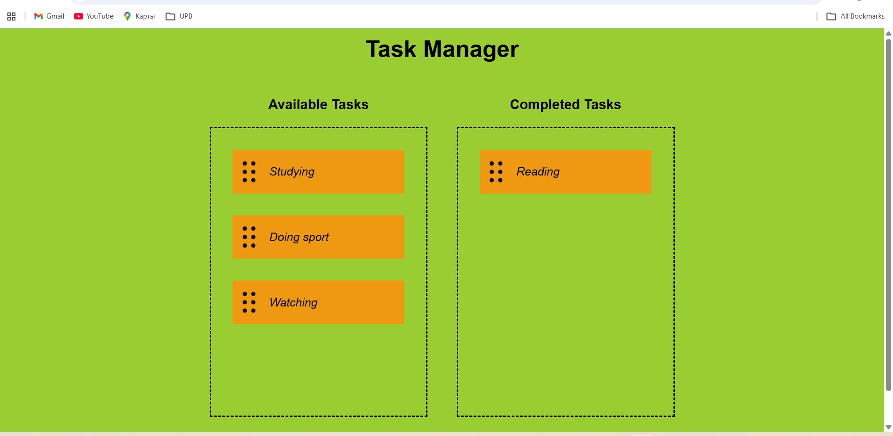

# Drag and Drop Task Manager

This is a simple drag and drop project built using HTML, CSS and JavaScript.

## Features
- Drag tasks from left to right
- Move tasks back to the original list
- Clean and simple user interface

## Technologies Used
- HTML
- CSS
- JavaScript (DOM manipulation and Drag & Drop API)

## Preview

## How to Use
1. Open the project
2. Run index.html in your browser
3. Drag tasks between boxes

## Purpose
I built this project to practice:
- DOM manipulation
- Event handling
- Drag and drop functionality

## Future Improvements
- Add new tasks input
- Save tasks using localStorage
- Improve UI design

## Live Demo

https://iamamiyeva.github.io/drag-and-drop-task-manager/
